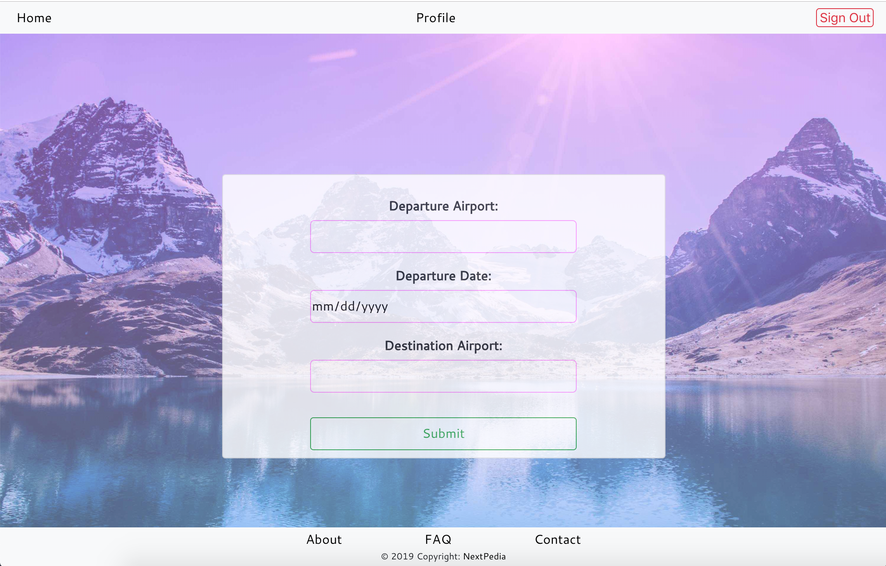
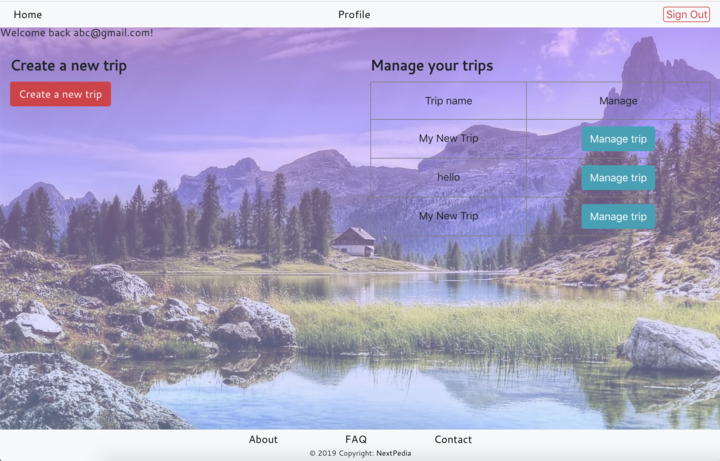
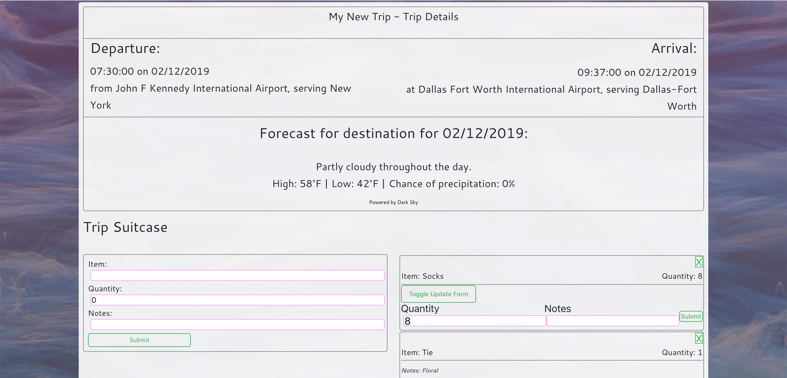

# NextPedia

Our App's Goal is to allow clients to book and manage vacations and flights that will be pushed to a cloud database. Clients will be able to create a personal account where they can book new trips, view existing trips, and manage their own virtual "suitcase" per trip.

https://nextpedia.herokuapp.com/

Login: test60@test.com Password: asdasdasd

Our App Pages:

Sign Up Page

Sign In Page

Flight Finder

User Profile

Trip Details

Flow of Application
The client will login to the application and be sent to the flight finder page. Once there the user will select an airport to fly from and to, along with a date of departure. The Flight page will the render and allow users to select from available flights that day and show the prices for each flight. After selecting a flight the user will be sent to their profile page, where the flight has been added and they can see previous flights they've booked. The user will have to option to manage their flight where they can see trip details and pack a virtual suitcase.

Technologies
React - A popular Javascript library used from building user interfaces
React-Router - Declarative router for React
MySql - SQL database 
Heroku - A cloud database used to deploy full stack applications
MongoDB - A NoSQL database used to store user, trip, and suitcase information
Firebase - Used to create and store sensitive login information  
Recompose - A React function utility belt
Context - An NPM package used to validate user credentials an sign in status

Team Members
John Eastwood, Kaleb Kougl, Ry DeSoto, Shawn Ard, Alex Green, Veronica Vera, Amer Albareedi

### Credits

- [OpenFlights](https://openflights.org/data.html) for use of the Airport database
- [Dark Sky API](https://darksky.net/poweredby/) for weather predictions for the Trip Details 
page
- [Robin Wieruch] used to create the basic firebase login functionality(https://www.robinwieruch.de/complete-firebase-authentication-react-tutorial/#react-firebase)
